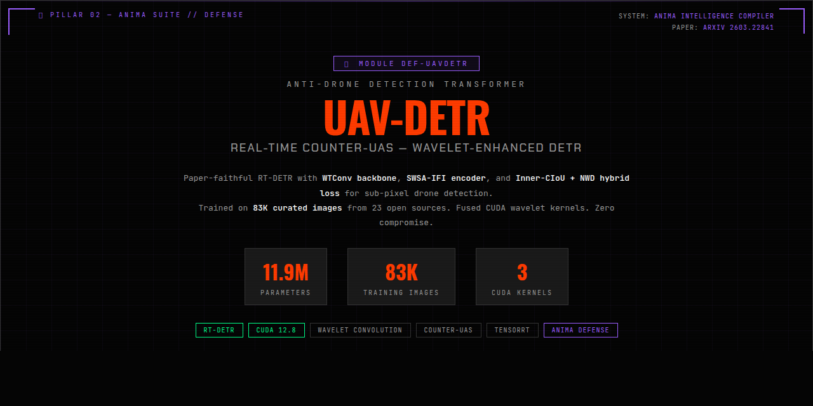

<p align="center">
  
</p>

# DEF-UAVDETR — Anti-Drone Detection Transformer

> **UAV-DETR: Real-Time Counter-UAS with Wavelet-Enhanced DETR**
> Paper: [arXiv:2603.22841](https://arxiv.org/abs/2603.22841) | Yang et al.

Part of the [ANIMA Intelligence Compiler Suite](https://github.com/RobotFlow-Labs) by AIFLOW LABS LIMITED.

## Overview

Paper-faithful RT-DETR implementation with four key innovations from the UAV-DETR paper:
- **WTConv Backbone** — Wavelet convolution preserving high-frequency detail for tiny aerial targets
- **SWSA-IFI Encoder** — Sliding-window self-attention on the deepest semantic feature map
- **ECFRFN Neck** — Cross-scale recalibration with SBA and RepNCSPELAN4
- **Inner-CIoU + NWD Loss** — Hybrid regression objective for small-box stability

**11.9M parameters** | **83K training images** | **3 custom CUDA kernels** | **5 export formats**

## Domain
Defense — Counter-UAS / Anti-Drone Detection

## Status
- [x] Paper verified + architecture extracted
- [x] PRD-01: Foundation & Config
- [x] PRD-02: Core Model (WTConv + SWSA + ECFRFN + Decoder + Loss)
- [x] PRD-03: Inference Pipeline (CLI + checkpoint I/O + export)
- [x] PRD-05: FastAPI Service + Docker (3-layer serve, CUDA/MLX)
- [x] PRD-06: ROS2 Integration (node + messages + launch)
- [x] PRD-07: Production (telemetry, runtime limits, benchmark, release)
- [x] ANIMA Infrastructure (anima_module.yaml, serve.py, Docker profiles)
- [x] CUDA Kernels (fused wavelet DWT/IDWT, deformable attention)
- [x] Training on 75K Seraphim dataset (GPU, in progress)
- [ ] Export: pth + safetensors + ONNX + TRT FP16 + TRT FP32
- [ ] Push to HuggingFace

## Quick Start
```bash
cd project_def_uavdetr
uv venv .venv --python python3.11 && uv sync
uv run pytest tests/ -v
uv run ruff check src/ tests/
```

## Inference
```bash
uv run python scripts/run_infer.py --source image.jpg --checkpoint best.pth
```

## API
```bash
# Start FastAPI server
uvicorn anima_def_uavdetr.api.app:app --host 0.0.0.0 --port 8080

# Detect
curl -X POST http://localhost:8080/predict -F file=@drone.jpg
```

## Docker
```bash
# Full stack (GPU + FastAPI + ROS2)
docker compose -f docker-compose.serve.yml --profile serve up -d

# API only (CPU debug)
docker compose -f docker-compose.serve.yml --profile api up -d
```

## Training
```bash
CUDA_VISIBLE_DEVICES=0 nohup uv run python scripts/train_cuda.py \
  --epochs 100 --batch-size 16 --datasets seraphim \
  > train.log 2>&1 & disown
```

## Architecture
```
Input RGB [B, 3, 640, 640]
  → WTConv Backbone (S2/S3/S4/S5)
  → Project S5 to 256ch
  → SWSA-IFI Encoder
  → ECFRFN Neck (P2..P5)
  → RT-DETR Decoder (300 queries)
  → Detections [x1, y1, x2, y2, score, class]
```

## License
MIT — AIFLOW LABS LIMITED
